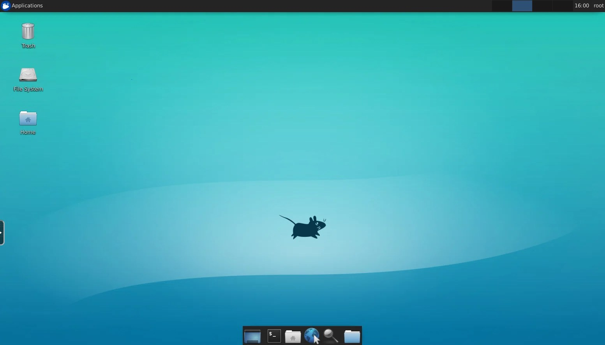

# 1. introduction.
###### this repo including ubuntu docker image with SSH and VNC support.
    
# 2. how to build and run.
###### 2.1 ubuntu18.04-kasmvnc-amd64
    docker build --force-rm --tag ubuntu18.04-kasmvnc-amd64:master --file ubuntu18.04-kasmvnc-amd64.dockerfile .
    docker run -itd --privileged -p :22 -p :6901 --name ubuntu18.04-kasmvnc-amd64 ubuntu18.04-kasmvnc-amd64:master

###### 2.2 ubuntu20.04-kasmvnc-amd64
    docker build --force-rm --tag ubuntu20.04-kasmvnc-amd64:master --file ubuntu20.04-kasmvnc-amd64.dockerfile .
    docker run -itd --privileged -p :22 -p :6901 --name ubuntu20.04-kasmvnc-amd64 ubuntu20.04-kasmvnc-amd64:master

###### 2.3 ubuntu22.04-kasmvnc-amd64
    docker build --force-rm --tag ubuntu22.04-kasmvnc-amd64:master --file ubuntu22.04-kasmvnc-amd64.dockerfile .
    docker run -itd --privileged -p :22 -p :6901 --name ubuntu22.04-kasmvnc-amd64 ubuntu22.04-kasmvnc-amd64:master

# 3. how use access container (for example).
    root@192.168.1.100:~# docker ps
    fe14f2c7cde9 ubuntu18.04-kasmvnc-amd64:master "/usr/bin/entrypoint" 1 minutes ago Up 1 minutes 0.0.0.0:49242->22/tcp, 0.0.0.0:49241->6901/tcp ubuntu18.04-kasmvnc-amd64

###### 3.1 SSH (port=49242).
    ssh -p 49242 root@192.168.1.100
    NOTE: 
    (1) default SSH username/password is root/cloud1234.

###### 3.2 VNC (port=49241).
    https://192.168.1.100:49241
    NOTE: 
    (1) default VNC username/password is cloud/cloud1234.
    (2) VNC password is hashed by executing python3 -c "import crypt; print(crypt.crypt('cloud1234', '\$5\$kasm\$'));"
    (3) one can use other password and replace hashed password part in /root/.kasmpasswd.

# 3. user scenario.
###### 3.1 install ffmpeg in those base images to show video or picture.
###### 3.2 install chrome in those base images to access internet.
###### 3.3 install pycharm in those base images to get a linux python develop environment.

# 4. kasmvnc link.
###### https://github.com/kasmtech
###### https://www.kasmweb.com/images
###### https://kasmweb.com/docs/latest/guide/custom_images.html
###### https://github.com/xfce-mirror
